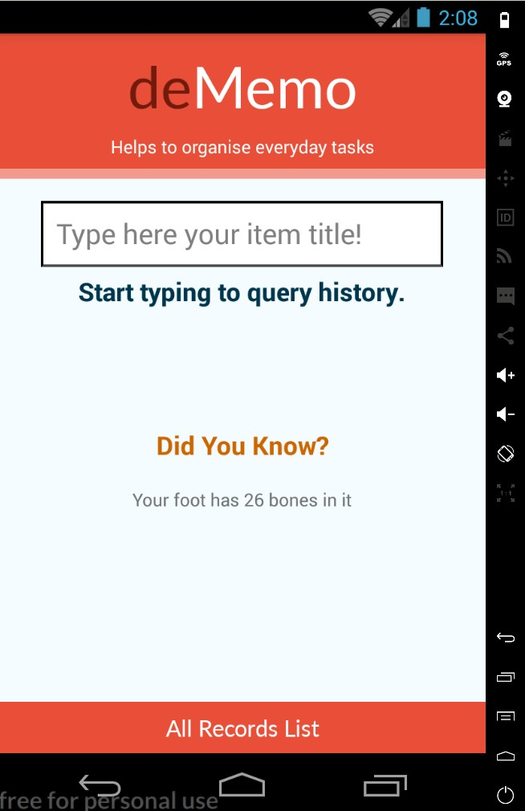
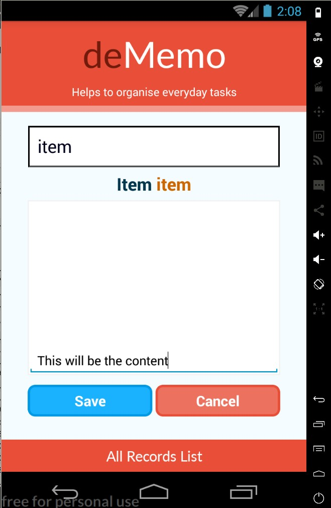
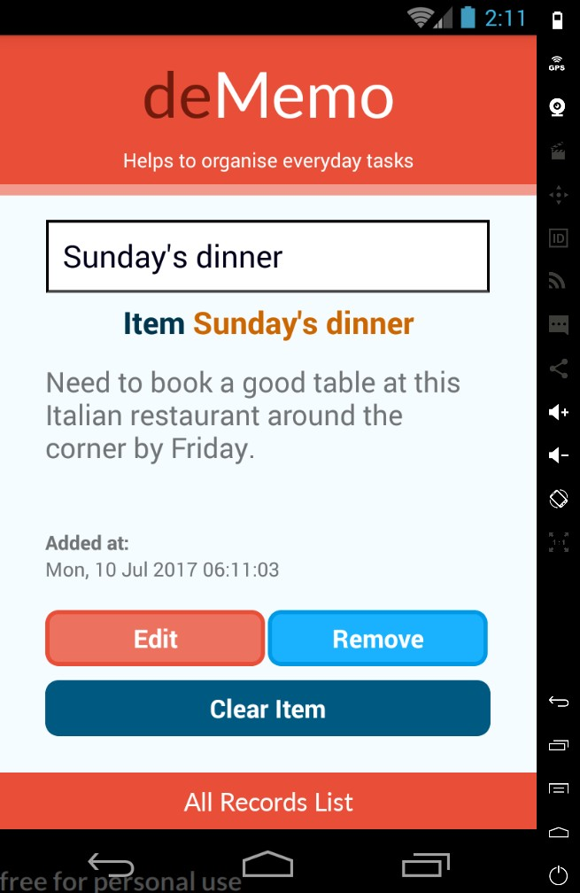
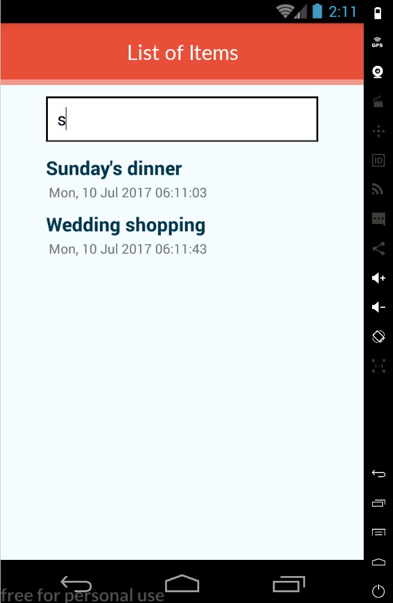

# deMemo
A simple, dynamic & database powered memo's storing application.

## Idea
  The main idea of application is to provide the user with dynamic, "sticky-note-like" memo lightweight application. There is no button for 'search' on the main application screen, just search bar which tackles all user's requests. It is smart enough to know, whether item exists in the system already or there's a need to create one. To add better user experience, there is small time delay between the last character typed and query execution.

## Tech Stack
React-Native with react-redux and Realm database for the backend. The choice was simple, Realm is super quick so it is possible to make many queries one after another without making visible delays for the user. 

## Improvements
The application is ready for the initial release, which will take place (for Android) bu the end of July.

## Screenshots
Main Screen                |  Create New Item
:-------------------------:|:-------------------------:
  |  

See Item Details           |  List View for All Items
:-------------------------:|:-------------------------:
   |   
